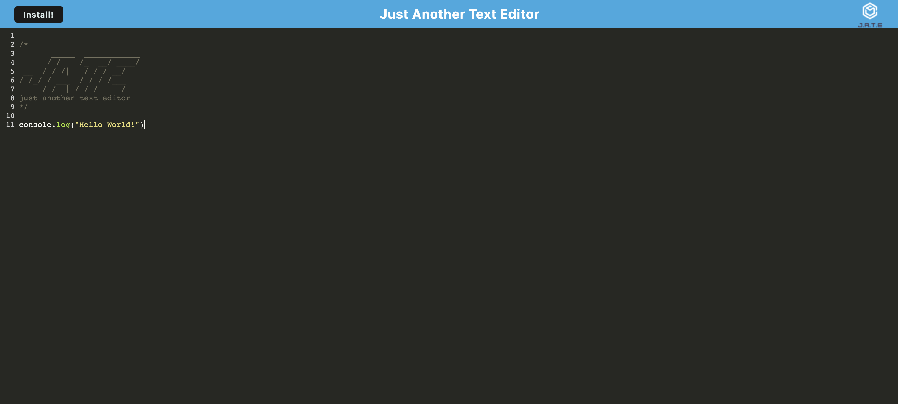

# Just Another Text Editor

## Table of Contents
- [Description](#description)
- [Installation](#installation)
- [Usage](#usage)
- [Questions](#questions)
  
## Description
J.A.T.E. (Just Another Text Editor) is exactly that - just another text editor. JATE includes formatting for Javascript syntax so you can practice your Javascript from within the browser or by installing the app the run offline!
  
## Installation
1. Open J.A.T.E. in your browser [here.](https://salty-tor-76149.herokuapp.com/)
2. Click on the install button on the top left corner of the page and the app will be installed locally to your machine.

## Usage
1. Open J.A.T.E. in your browser or open the app locally.
2. Type away! Your changes will be automatically saved.

## Questions

**If you have any additional questions please reach out to me here**:
- Github: [RetroTechCode](https://github.com/RetroTechCode)